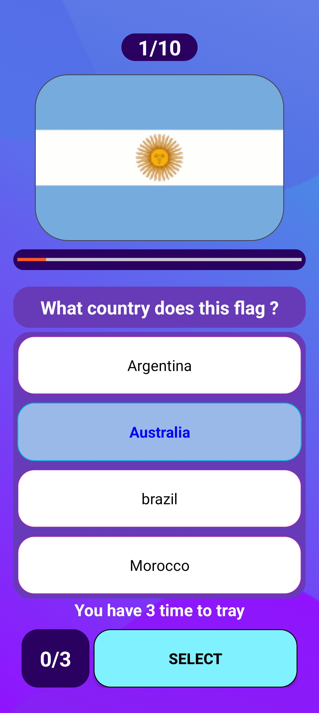
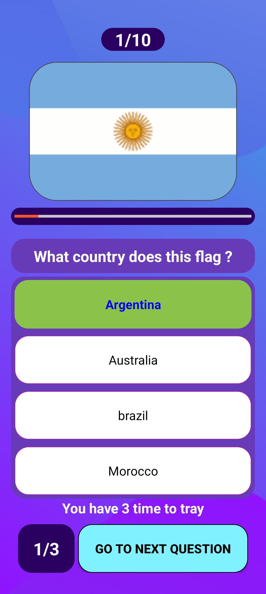

# MyCalculatorApp

About
The Quiz App is a fun game that asks questions about countries.
You can test your knowledge about capitals, flags, and famous places.

---
## 📱 Screenshots

   

---
## 🛠 Features
- Add, subtract, multiply, divide
- Supports negative numbers
- Clear button to reset calculations
- Simple and responsive UI
---
## ⚙️ Installation

1. Clone the repository:

```bash
https://github.com/anasouamira/Quiz-App.git
